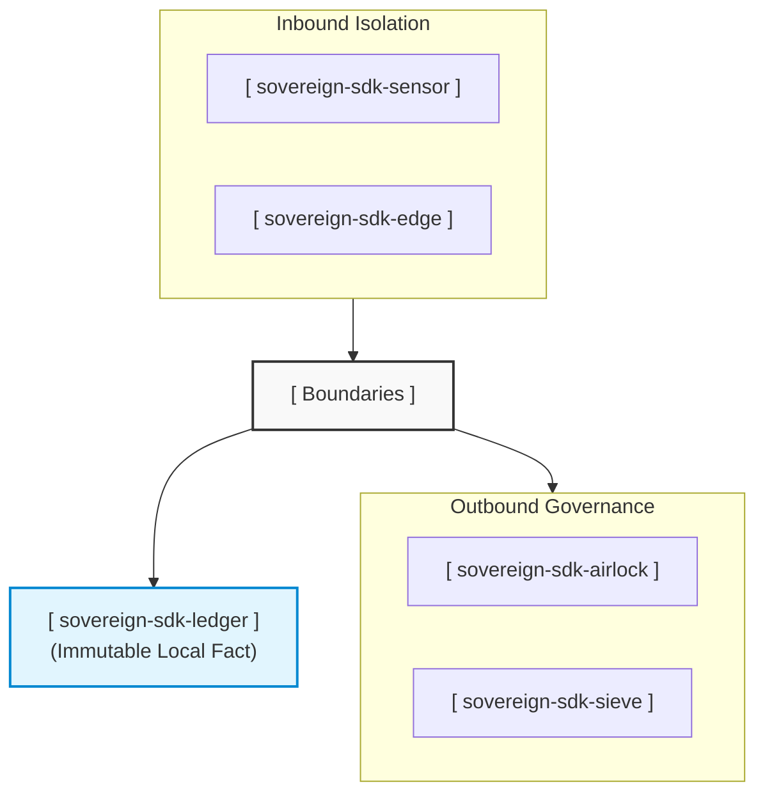

# The Sovereign Systems Manifesto: Engineering Computational Independence

## 1. The Core Crisis: The Feudal Cloud

The modern technology ecosystem has quietly reverted to a model of digital feudalism. 

For the past two decades, organizations have been conditioned to accept a singular, dangerous architectural premise: that local computing infrastructure is inherently untrustworthy, and that operational intelligence can only exist when tethered to a centralized cloud empire. The industry has traded resilience for convenience, surrendering absolute data custody, predictable operational margins, and institutional memory to a handful of hyperscalers.

The sudden rise of frontier artificial intelligence has accelerated this crisis into an existential threat. Today’s enterprise architectures routinely route their most sensitive operational intelligence, proprietary codebases, and real-time physical telemetry across porous perimeters to external third-party model APIs. 

This status quo has extracted a severe penalty:
* **The Prose Tax:** Enterprises pay compounding financial premiums to remote servers simply to transfer unoptimized, conversational text bloat over the wire.
* **The Autonomy Defect:** Critical physical systems—from manufacturing floors to logistics hubs—are forced to grind to a halt the moment a remote cloud region experiences a network drop or a routing failure.
* **The Provenance Vacuum:** Data is altered, timestamped, and cataloged by third-party database engines after the fact, stripping local operators of an un-falsifiable record of truth at the point of origin.

The Sovereign Systems Specification exists to break this dependence. We believe that true operational independence requires shifting control from centralized cloud layers directly to deterministic computational boundaries.

---

## 2. The Solution: Boundary Governance

Sovereign Systems does not compete on model size, nor do we build transient orchestration wrappers. We design infrastructure to govern the exact milestones where data crosses structural boundaries.

Our philosophy is built on three unyielding pillars:
1. **Write-Side Custody:** Data must be cryptographically sealed via local silicon at the exact millisecond it is born (Point of Genesis) and preserved through infinite network defects utilizing multi-writer, append-only local ledger structures.
2. **Outbound Autonomy:** External data exchanges must be actively intercepted, audited, and optimized by local inline proxies before a single token crosses an organizational trust perimeter.
3. **Ecosystem Immortality:** Core data custody tools must be zero-dependency, open-source primitives, ensuring an enterprise's software architecture can survive the economic or operational failure of any single vendor—including us.

---

## 3. The Future: The Federated Perimeter

When this specification succeeds, the geometry of computing changes. 

Instead of a fragile web of dumb terminals feeding a single monolithic hyperscaler brain, the global infrastructure matrix will transform into a federated network of high-assurance, autonomous perimeters. 
* Factory floors will run, self-audit, and maintain compliance records through localized grid failures.
* Historical preservation labs will anchor cultural provenance directly to local storage media for centuries without paying continuous infrastructure rents.
* Developer workstations will actively prevent corporate intellectual property leaks before commands leave local memory space.

We do not monetize local data custody, nor do we tax off-grid execution. The Sovereign SDK creates the baseline capability for an organization to own its data securely. The commercial ecosystem—led by **Sovereign Airlock** and **Sovereign Audit**—monetizes the confidence, active compliance, and financial optimization required when data moves between distinct sovereign jurisdictions.

Autonomy belongs at the perimeter. The declaration has been signed.
