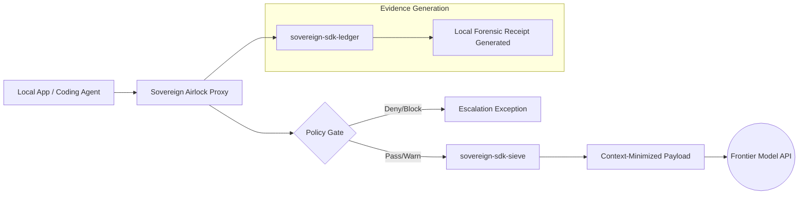

# Airlock Outbound Boundary Architecture

## Mandate
The Outbound Boundary intercepts data structures originating within sovereign applications or automated developer agents before they are transmitted over the wire to untrusted third-party cloud architectures or frontier model APIs. It is governed by `sovereign-sdk-airlock`.

## Topology

## Architectural Specifications

1. **Deterministic Execution Layer:** Functions as an inline, model-neutral gateway proxy that sits directly between applications and APIs (Anthropic, OpenAI, Ollama).
2. **Context Minimization Proxy:** Passes requests through `sovereign-sdk-sieve` to calculate structural reduction metrics and output raw-to-compressed token ratios, explicitly calculating and optimizing out the enterprise "Prose Tax."
3. **Policy-Driven Interception:** Evaluates token limits, sensitive signatures, and semantic safety parameters in a strict non-blocking (Passive) or blocking (Active) manner based on machine-local YAML constraints.