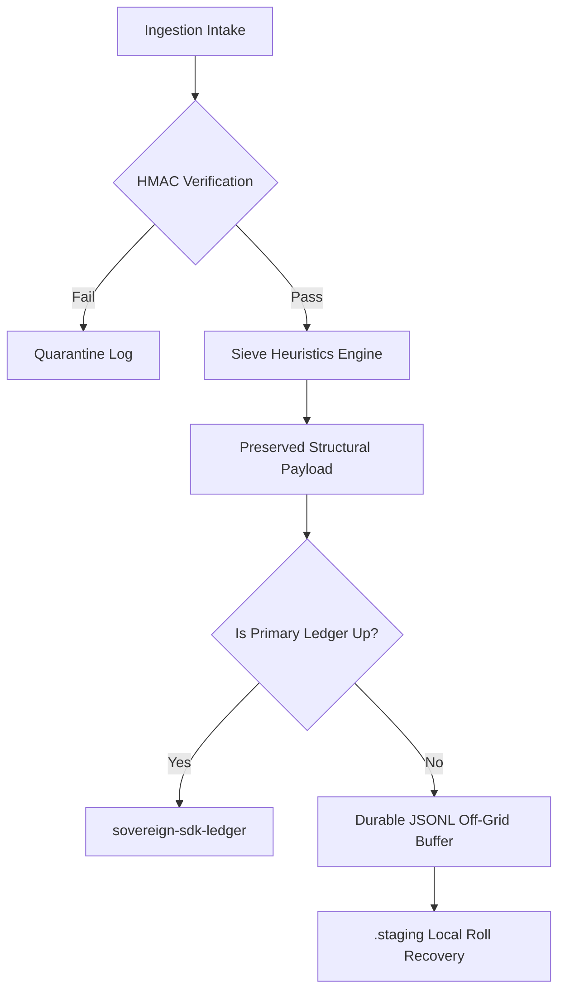

# Edge Boundary Architecture

## Mandate
The Edge Boundary sits directly at the peripheral compute node (e.g., Raspberry Pi CM4). It receives signed data from the [Ingestion Boundary](https://kenwalger.github.io/sovereign-system-spec/terms/ingestion-boundary.html?utm_source=sovereign-sdk&utm_medium=repository&utm_campaign=sovereign-sdk-repo), parses it, filters semantic noise using heuristic sieves, and maintains local data durability across complete infrastructure failures. It is governed by `sovereign-sdk-edge`.

## Local Pipeline & Off-Grid Core Topology

## High-Assurance Invariants

1. **The Isolation Lock:** The entire off-grid logging lifecycle (`drain`, `replay`, `commit_drain`) is explicitly bound to a cross-process synchronization lock tied to the system's machine UUID path, completely eliminating concurrent file-clearing race conditions.
2. **Synchronous Serialization:** Both on-disk quarantine logs and volatile in-memory error snapshots are force-serialized into physical `.staging` artifacts before any transaction logic yields, preventing data loss across power drops.
3. **The Sieve Transformation Layer:** Applies zero-dependency structural and table-tagging primitives to slice out redundant prose, formatting, or telemetry bloat before it occupies local sector paths.