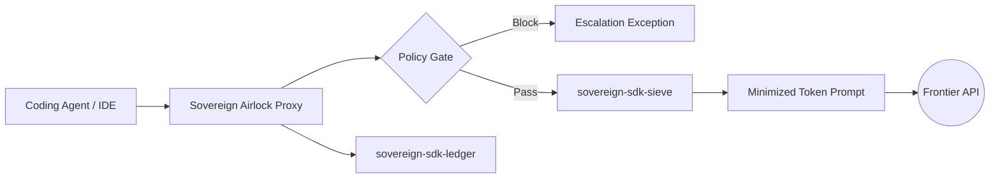

# Developer Workstation Blueprint: Outbound Context Leak Governance
## Executive Summary
Modern engineering teams are rapidly adopting autonomous AI coding agents (such as Claude Code, Cursor, and terminal assistants). While these tools drastically accelerate feature velocity, they represent a massive outbound security risk. Automated tools routinely bundle massive source-code context trees, internal environment configurations, and sensitive local secrets, shipping them across corporate perimeters to third-party LLM provider APIs with zero internal visibility or cost governance.

This blueprint outlines how Sovereign Airlock acts as a local security boundary directly on a developer's 14-inch workstation, intercepting context leaks and checking cost compliance before a single token leaves the machine.

## Architectural Topology

## Component Integration Matrix
1. The Outbound Interceptor (`sovereign-sdk-airlock`)  
- **Deployment:** Installed locally via developer shell profiles (`.zshrc` / `.bashrc`) or bound to local IDE execution loops.
- **Execution:** When a coding agent attempts to call an external model API (Anthropic, OpenAI, etc.), the request is intercepted by the local Airlock gateway proxy. The proxy reads the transaction in a completely model-neutral manner.

2. The Context Optimization Layer (`sovereign-sdk-sieve`)  
- **Deployment:** Runs locally in active workstation memory as an inline dependency of the Airlock proxy.
- **Execution:** Outbound payloads pass through `sovereign-sdk-sieve` to calculate structural metrics. Sieve analyzes the prompt data, strips out prose waste or massive redundant log files, and outputs raw-to-compressed token ratios. This explicitly calculates the local "Prose Tax" reduction, saving enterprise compute capital before transmission occurs.

3. The Governance Gate (`sovereign-sdk-ledger` & Policy Engine)  
- **Deployment:** Local background daemon backed by an active YAML configuration policy.
- **Execution:** The proxy checks the request against machine-local policies (e.g., maximum token ceilings or sensitive keyword triggers). Depending on the policy rule, it will **Allow**, **Warn**, or **Deny** the transmission. Regardless of the outcome, the event is logged directly to `sovereign-sdk-ledger` to create a local, non-falsifiable audit trail tracking exactly what data left the workstation, why it left, and what it cost.