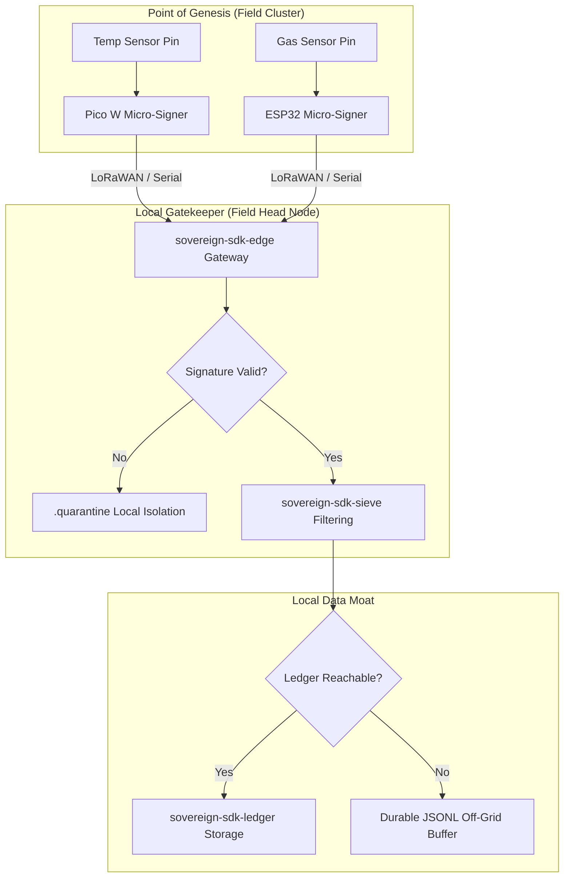

# Internet of Things (IoT) Blueprint: Decentralized Environmental Mesh
## Executive Summary
Traditional IoT architectures rely on the "hub-and-spoke" model, where low-power edge nodes blindly stream telemetry to a central cloud gateway. When backhaul connectivity fails, the perimeter goes blind. If the central cloud experiences data-drift or schema mutations, historical device logs can become quietly corrupted.

This blueprint demonstrates how the Sovereign Systems Specification establishes a zero-trust, resilient telemetry mesh. By utilizing local-first signing and disconnected journaling, edge clusters retain complete data integrity and operations continuity through infinite network drops.

## Architectural Topology

## Component Integration Matrix

1. The Genesis Boundary (`sovereign-sdk-sensor`)  
- **Deployment:** Pre-flashed onto bare-metal sensor arrays (e.g., Raspberry Pi Pico W, ESP32) deployed across localized environmental zones.
- **Execution:** Ambient sensors track continuous metrics (temperature, gas levels, vibration metrics). The micro-signer casts raw hardware register values into strongly typed canonical schemas, immediately wrapping the telemetry in a hardware-bound HMAC-SHA256 signature before it hits an active transmission antenna.

2. The Local Gatekeeper (`sovereign-sdk-edge`)  
- **Deployment:** Operates on localized field gateways acting as regional cluster heads.
- **Execution:** The gateway ingests incoming radio or serial data packets. Every packet's signature is checked; invalid frames or unauthorized injection attempts are instantly shunted to a local `.quarantine` log block. Valid data is filtered through `sovereign-sdk-sieve` primitives to isolate true metric changes, eliminating repetitive baseline noise before disk storage.

3. The Failure Moat (`sovereign-sdk-ledger`)  
- **Deployment:** Localized, thread-isolated SQLite state snapshots and append-only disk files on the gateway node.
- **Execution:** Valid records are committed locally. If the primary cloud data pipeline drops, the **Asynchronous Off-Grid JSONL Buffer** safely stores the entries in an immutable sequence. Once network backhaul returns, the system gracefully drains the buffer without dropping a single metric marker.