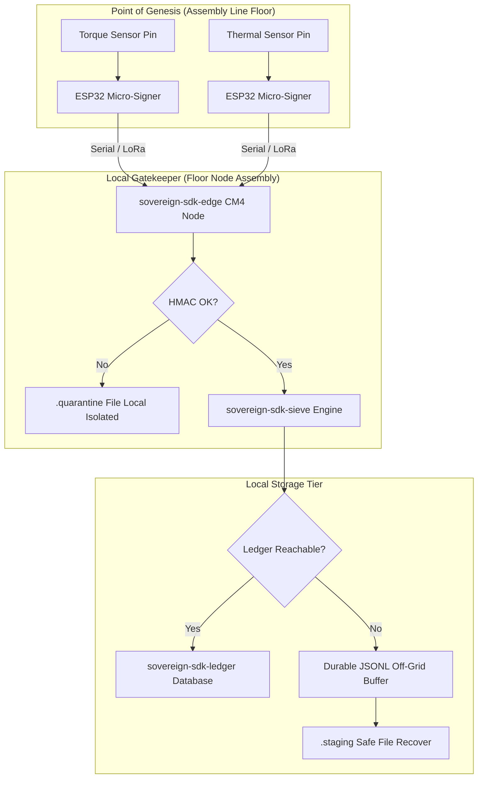

# Industrial Manufacturing Blueprint: Continuous Line Compliance

## Executive Summary
In high-assurance manufacturing, telemetry data collected from the assembly line (e.g., torque thresholds, thermal metrics, chemical mixture boundaries) represents core regulatory compliance evidence. Traditional cloud-reliant IoT architectures fail under infrastructure stress—if a network switch drops or a cloud region goes down, the assembly line either halts or operates blindly, risking un-audited product cycles.

This blueprint demonstrates how the Sovereign SDK enforces **Write-Side Custody** on the manufacturing floor, guaranteeing zero data loss, un-falsifiable record keeping, and total operational continuity across localized network defects.

## Architectural Topology

## Component Integration Matrix
1. The Genesis Boundary (`sovereign-sdk-sensor`)  
- **Deployment:** Embedded directly on bare-metal ESP32 microcontrollers wired to line machinery.
- **Execution:** As raw voltage metrics trip threshold triggers, the micro-signer instantly binds the telemetry value, a monotonic counter, and an millisecond timestamp into a minified byte envelope. The payload is cryptographically sealed utilizing the microcontroller's onboard hardware security module.

2. The Local Gatekeeper (`sovereign-sdk-edge`)  
- **Deployment:** Runs locally on an industrial Raspberry Pi Compute Module 4 (CM4) tracking the specific assembly sector.
- **Execution:** Catching signed telemetry streams over serial connections, the edge pipeline verifies authenticity. If a payload's signature fails validation or has been altered by an inline line defect, it is shunted into an append-only quarantine log for security auditing. Authentic data is passed directly through zero-dependency sieve heuristics to eliminate repetitive ambient noise strings before long-term serialization.

3. The Failure Moat (`sovereign-sdk-ledger` & Buffer)  
- **Deployment:** Local solid-state storage volume attached to the floor node.
- **Execution:** Under standard operations, validated payloads are committed directly to `sovereign-sdk-ledger`, capturing a non-repudiable Forensic Receipt. During a network fault or primary database disconnection, the system seamlessly redirects transactions to the **Asynchronous Off-Grid JSONL Buffer**. The atomic `.staging` architecture guarantees that even if the floor node experiences a sudden power loss during a shift failure, no compliance records are dropped or corrupted.

## Real-World Value Metrics
- **0% Data Loss Tolerance:** Telemetry validation is completely decoupled from cloud uptime.
- **Tamper-Proof Compliance Logs:** Signature matching at the Point of Genesis prevents historical log alteration on the factory floor.
- **Hardware Efficiency:** Algorithmic text sieving minimizes data payload footprints by up to 60% before archiving, expanding the local offline storage survival window from days to months.