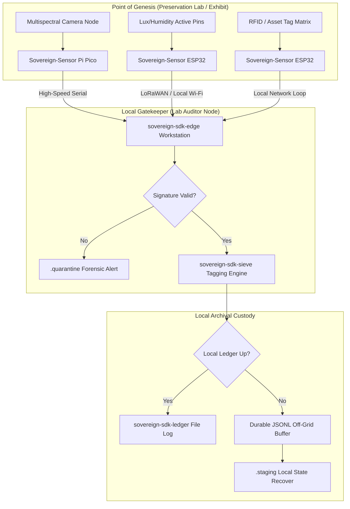

# Museum & Archival Preservation Blueprint: High-Assurance Forensic Provenance

## Executive Summary
In cultural preservation, museum cataloging, and rare book forensics, data integrity is institutional memory. When a rare manuscript undergoes multispectral imaging, or an antiquity is captured via heavy photogrammetry sequences, the resulting state snapshots must be cryptographically anchored to prevent historical revisionism, data degradation, or chain-of-custody contamination.

This blueprint outlines a local-first deployment architecture where specialized capture hardware, ambient monitoring arrays, and archival audit tools combine to build an immutable ledger of an artifact's physical existence. It guarantees that archival records remain pristine and verifiable even if the underlying cloud ingestion platforms fail, shift APIs, or go out of business.

## Architectural Topology

## Component Integration Matrix
1. The Genesis Boundary (`sovereign-sdk-sensor`)  
- **Deployment:** Integrated directly into multispectral camera triggers, high-resolution photogrammetry capture workstations, and ambient climate nodes monitoring sensitive display display vitrines.
- **Execution:** The moment an image sensor fires or an asset tag is scanned, sovereign-sdk-sensor binds the file hash, machine UUID, a monotonic frame counter, and the spatial tracking metadata into a tight canonical schema. An onboard cryptographic chip signs the envelope instantly, sealing the metadata at the physical source of origin before the heavy image payload is even transferred to local storage arrays.

2. The Local Gatekeeper (`sovereign-sdk-edge`)  
- **Deployment:** Operates on the local preservation lab’s 14-inch Apple Silicon workstations or dedicated local compute infrastructure.
- **Execution:** sovereign-sdk-edge intercepts the stream of incoming capture metrics and asset telemetry. If a signature check fails—indicating that sensor output data or an index field was altered in transit—the packet is cleanly routed to an isolated .quarantine system file for immediate forensic evaluation. Authentic payloads are processed by zero-dependency sieve filters that isolate raw structural metadata parameters (§) from prose descriptions or operational noise.

3. The Failure Moat (`sovereign-sdk-ledger` & Buffer)  
- **Deployment:** Solid-state storage partitions or attached NVMe local physical drives bound to the processing laboratory.
- **Execution:** Validated records write directly to sovereign-sdk-ledger as an append-only transaction stream. If a localized storage network or backend cataloging server experiences a total drop during a high-speed archival pass, the Asynchronous Off-Grid JSONL Buffer takes over. The system buffers the transaction state directly to disk via atomic .staging file lock boundaries. Even if a sudden facility power event occurs mid-sequence, the preservation index is preserved with absolute zero record corruption.

## Forensic Use-Case Configuration: The Rare Book Auditor
When evaluating historical manuscripts, ledger files, or rare bindings, a "Forensic Rare Book Auditor" setup integrates the system to track structural state alterations over time:

1. **Environmental Correlative Ledger:** Matches continuous climate parameters (Lux exposure, humidity spikes) directly against the artifact’s tracking records, establishing a permanent correlation log of external stressors.
2. **Photogrammetry Lineage Verification:** Ensures that every single image in a 500-frame 3D model reconstruction sequence possesses a sequential, non-repudiable micro-signature matching a specific camera position and time signature.
3. **Immutable Metadata Anchors:** Generates a lightweight, verifiable file fingerprint that can be distributed publicly or to research institutions to confirm provenance without revealing high-resolution, proprietary imaging assets.

## Real-World Institutional Value
- **Permanent Provenance:** Decouples structural data custody from proprietary collection management software (CMS) or volatile cloud database systems.
- **Forensic Security:** Prevents internal unauthorized record alteration or tampering, creating an ironclad audit track for high-value cultural assets.
- **Storage Footprint Sanity:** Algorithmic sieving maps data to structural tables and tags, allowing local nodes to preserve structural data lineage natively on disk for decades without scaling infrastructure costs.

