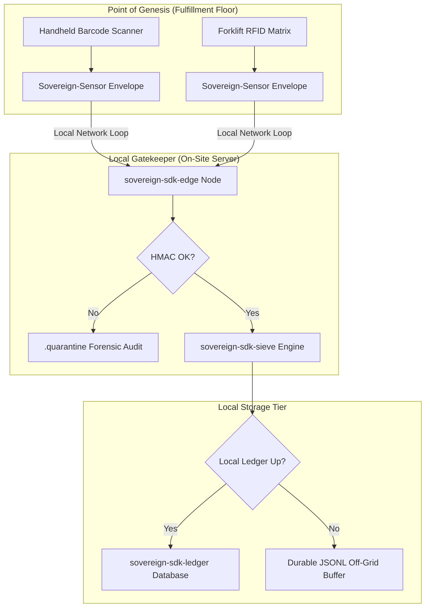

# Logistics & Warehouse Blueprint: High-Throughput Asset Inventory Tracking
## Executive Summary
Warehouse logistics require flawless chain-of-custody tracking across thousands of moving assets. If a localized warehouse management system (WMS) drops connection to its central cloud database during peak sorting operations, fulfillment grinds to a halt, or inventory tracking faces immediate discrepancies.

This blueprint utilizes the Sovereign SDK to decouple physical inventory ingestion from active cloud connection states, ensuring every scan is cryptographically anchored and stored locally with zero-fault durability.

## Architectural Topology

## Component Integration Matrix
1. The Genesis Boundary (`sovereign-sdk-sensor`)  
- **Deployment:** Integrated directly into handheld barcode scanners, automated forklift RFID arrays, and sorting-belt optical cameras.
- **Execution:** Each asset capture event generates an instantaneous structural payload containing the asset SKU, location marker, and scanner identity. The sovereign-sdk-sensor envelope secures this metadata right at the scanner level, creating an un-alterable tracking log point before transmission.

2. The Local Gatekeeper (`sovereign-sdk-edge`)  
- **Deployment:** Runs on a dedicated on-site server rack located directly inside the distribution center.
- **Execution:** Ingests high-throughput scanning streams. If a scan contains corrupted data or an invalid signature envelope, the pipeline flags the item and moves the log to a quarantine directory for security auditing. Clean records are parsed, structured, and prepared for transactional execution.

3. The Failure Moat (`sovereign-sdk-ledger` & `sovereign-sdk-fastapi`)  
- **Deployment:** Local high-performance SSD array running a local sovereign-sdk-fastapi proxy instance.
- **Execution:** Every successful scan is committed directly to sovereign-sdk-ledger to secure a non-repudiable Forensic Receipt. If a central cloud region goes dark, the off-grid JSONL buffer absorbs the entire throughput volume of the warehouse floor seamlessly. The atomic .staging framework guarantees complete data protection against sudden facility-wide power failures.