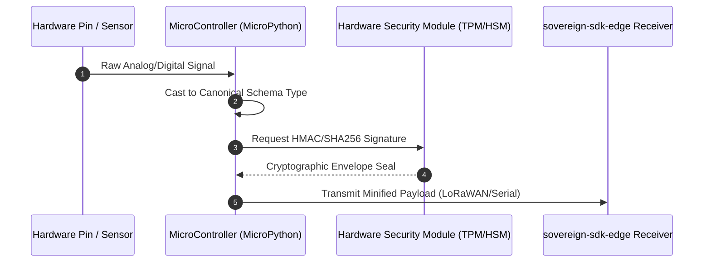

# Ingestion Boundary Architecture

## Mandate
The Ingestion Boundary dictates how physical properties, environmental changes, or raw systemic inputs crossing a bare-metal pin array freeze into a deterministic digital entity. It is governed exclusively by `sovereign-sdk-sensor`.

## Components & Data Flow

## Architectural Specifications

1. **Canonical Schema Typing:** Raw hardware voltage matrices or bitstreams must immediately be cast into strongly typed, schema-validated structures.
2. **Point-of-Genesis Micro-Signing:** Payloads must be cryptographically sealed via on-chip hardware acceleration (HMAC-SHA256) at the exact millisecond of capture.
3. **Minified Envelope Serialization:** The transmission packet must remain optimized for constrained telemetry fabrics, separating metadata (Signatures, Nonces, Timestamps) from structural sensor fields.