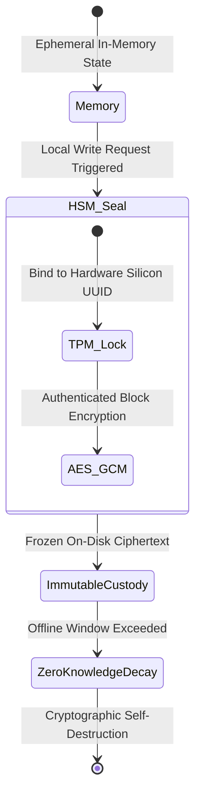

# Vault Boundary Architecture

## Mandate
The Vault Boundary dictates how ephemeral, highly dynamic data states held in active process memory freeze securely into immutable long-term local custody. It provides structural physical protection for localized secret keys, forensic records, and encryption roots. It is governed by `sovereign-vault`.

## State Transformation Topology

## Architectural Specifications

1. **Hardware-Bound Sealing:** Binds local storage encryption keys directly to machine security modules (HSM/TPM) found on local edge chips rather than exposing cleartext master keys on system configuration paths.
2. **Zero-Knowledge Ephemeral Decay:** Enforces time-locked cryptographic decay states on sensitive historical logs, causing local cryptographic volumes to self-destruct or systematically compact if they do not receive a secure, validated remote synchronization pulse within designated operational horizons.
3. **Namespace Cryptographic Partitioning:** Generates hard logical and cryptographic boundaries between system processes, preventing local privilege escalations from reading sibling component ledgers.