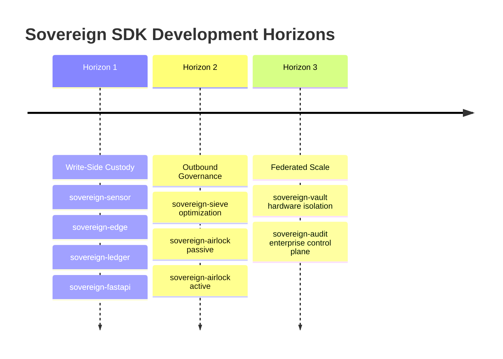

# Strategic Roadmap: Ingestion to Federated Governance

The Sovereign Systems Specification executes across three distinct architectural horizons, moving systematically from write-side data custody to comprehensive outbound edge governance and federated corporate observability.

## Horizon 1: Write-Side Custody (The Ingestion Foundation)

- **Status:** Completed & Validated (v1.3.0 Release Group)
- **Objective:** Establish un-falsifiable record-keeping, secure micro-signing protocols, and durable off-grid buffering right at the local computing perimeter.

### Delivered Components:  

- `sovereign-sdk-sensor`: MicroPython-compatible Point-of-Genesis micro-signers.
- `sovereign-sdk-edge`: Low-footprint constraint engines, SQLite state snapshots, and durable async JSONL off-grid recovery buffers.
- `sovereign-sdk-sieve`: Lightweight string and semantic noise reduction heuristics.
- `sovereign-sdk-ledger`: Thread-isolated, append-only local cryptographic log database.
- `sovereign-sdk-fastapi`: Secure high-performance middleware proxy loops for unified integration.

## Horizon 2: Outbound Governance (The Perimeter Control)

- **Status:** Active Planning / Initial Inception
- **Objective:** Intercept, analyze, minimize, and optionally govern data structures before they leave the corporate network boundary destined for third-party frontier APIs.

### Core Focus Areas:

1. `sovereign-sdk-airlock` **(Phase 1: Passive Observation):**

- Implement non-blocking request mirroring and inline token accounting.
- Generate forensic outbound receipts mapping payload hashes to specific external model target destinations.
- Deliver automated "Prose Tax" calculation matrices.

2. `sovereign-sdk-airlock` **(Phase 2: Active Enforcement):**

- Embed inline active context-minimization mechanics utilizing hardened `sovereign-sdk-sieve` components.
- Deploy active warning thresholds and policy enforcement rules (Allow, Warn, Deny) based on token budget limits and sensitive keyword signatures.

3. Developer Environment Wrappers (Phase 3):

- Build native terminal and IDE extension boundaries targeting automated AI coding agents (e.g., Claude Code, Cursor) to manage context-leak risks on engineering workstations.

## Horizon 3: Federated Scale & Hardened Security (The Enterprise Moat)
- **Status:** Future Investigation
- **Objective:** Aggregate localized cryptographic receipts across distributed environments into centralized governance control planes while reinforcing edge physical security.

### Core Focus Areas:

1. `sovereign-vault` **(Memory → Custody Boundary):**

- Implement zero-dependency local hardware security module (HSM) and Trusted Platform Module (TPM) chip bindings to seal local data volumes.
- Author time-locked, zero-knowledge decay states ensuring automatic cryptographic self-destruction of edge records if local offline periods exceed authorization metrics.

2. `Sovereign Audit` **(The Enterprise Control Plane):**

- Construct a centralized SaaS dashboard and observability control layer that aggregates decentralized local ledger outputs from thousands of active deployment sites.
- Expose macro corporate analytics tracking macro token-utilization efficiency, global Prose Tax savings, cross-department model cost allocations, and regulatory compliance evidence logs.

